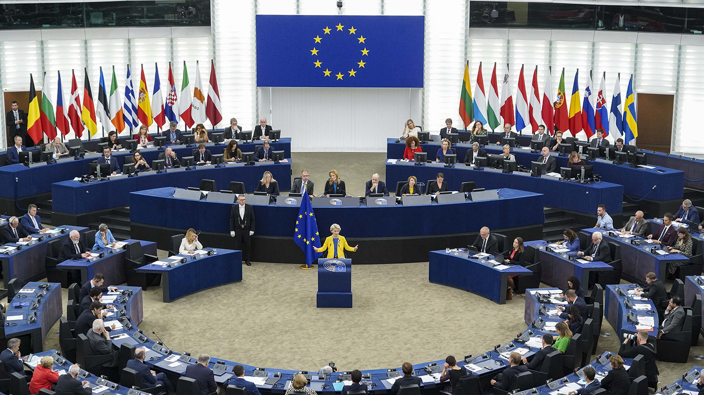

# Introduction

Each September, the President of the European Commission gives a speech in the plenary session of the European Parliament about last year's achievements and presents the priorities for the next one.

```{r, echo=FALSE, fig.height=5}

```

In this assignment we will be applying some basic text mining techniques to extract useful information from speeches comprehended between 2010 and 2023. During this period, the European Commission had three different presidents, Barroso, Juncker and von der Leyen, so we'll also be looking for similarities and differences across years and presidents. We'll perform sentiment analysis to compare positivity and negativity across speeches, we will use TF-IDF to determine the most distinctive words each year and lastly we will do topic modelling to classify the speeches depending on their theme.

As an initial hypothesis we expect to have a big amount of similarities regarding the style and the words used between presidents because, although each one of them may have their particular style and some particular event to address, these type of discourses tend to follow a formal and structured scheme and consistently mention key policy areas.

Moreover, in the sentiment analysis we expect to achieve greater negativity between 2010 and 2016 and in 2020-2022 because it was the period of the Eurozone debt crisis and the COVID-19 pandemic and the Ukraine war, respectively.

Similarly we expect the main topics of the speeches to reflect these main challenges faced by the Union (financial crisis, COVID, Ukraine), as well as maybe a mentioning of Brexit.

# Library

Installing and loading packages.

```{r, warning = FALSE, message = FALSE}
rm(list = ls())
# install.packages("tidyverse")
# install.packages("tidytext")
# install.packages("wordcloud")
# install.packages("topicmodels")
# install.packages("scales")
# install.packages("patchwork")
# install.packages("quanteda")
library(tidyverse)
library(tidytext)
library(wordcloud)
library(topicmodels)
library(scales)
library(patchwork)
library(quanteda)
```

# Loading data

Here we read the speeches and we assign the year in which they were held and the president that delivered each of them.

All the speeches have been obtained from the [European's Commission website](https://state-of-the-union.ec.europa.eu/index_en) and speeches' section headings or subheadings have been deleted.

```{r}
speech_2010 <- read_file("speeches/2010.txt") 
speech_2011 <- read_file("speeches/2011.txt")
speech_2012 <- read_file("speeches/2012.txt") 
speech_2013 <- read_file("speeches/2013.txt") 
speech_2015 <- read_file("speeches/2015.txt")
speech_2016 <- read_file("speeches/2016.txt") 
speech_2017 <- read_file("speeches/2017.txt") 
speech_2018 <- read_file("speeches/2018.txt") 
speech_2020 <- read_file("speeches/2020.txt") 
speech_2021 <- read_file("speeches/2021.txt") 
speech_2022 <- read_file("speeches/2022.txt") 
speech_2023 <- read_file("speeches/2023.txt") 

speeches <- tibble(
  year = c(2010, 2011, 2012, 2013, 2015, 2016, 2017, 2018, 2020, 2021, 2022, 2023),
  text = c(
    speech_2010, speech_2011, speech_2012, speech_2013,
    speech_2015, speech_2016, speech_2017, speech_2018,
    speech_2020, speech_2021, speech_2022, speech_2023))

speeches <- speeches |> 
  mutate(president = case_when(
    year %in% c(2010, 2011, 2012, 2013) ~ "Barroso",
    year %in% c(2015, 2016, 2017, 2018) ~ "Juncker",
    year %in% c(2020, 2021, 2022, 2023) ~ "von der Leyen"))
```

Note that some years are missing. These years correspond to European election years, during which the Commission and the Parliament are typically in transition and not yet fully in office and thus the speech is not delivered.

# Pre-processing

As for most text mining pipelines, the first step is to proceed with tokenization. Then, since stop words do not add useful information to our analysis we are filtering them out .

```{r}
# Tokenizing by word
tokenized_speeches <- speeches |> 
  unnest_tokens(word,text, token="words") |> 
  # Removing possessive to end of words (ex country's becomes country)
  mutate(word = gsub("'s$", "", word)) |> 
  mutate(word = gsub("’s$", "", word))
# Note that I need to remove possessive for two slightly different apostrophe
# Because ' and ’ are different characters I need to handle them both

stop_words <- stop_words

# Removing stopwords
filtered_speeches <- tokenized_speeches |> 
  anti_join(stop_words, by = "word")
```

# Analysis

## Word frequency

### Unigrams

What are the most used words in the speeches?

```{r}
filtered_speeches |> 
  # Counting the words
  count(word, sort = TRUE) |> 
  # Filtering only those used more than 100 times
  filter(n > 100) |>  
  # Plotting the most used
  ggplot(aes(n, reorder(word, n))) +
  geom_col(fill = "#004494") +
  labs(title = "Most used words in EU State of the Union speeches 2010-2023",
       y = NULL, 
       x = "Number of times used") +
  theme_minimal()
```

In a first look, we can observe that the most used words are making reference to Europe, the European Union and the Commission as well as to the European people to which these speeches are directed. Other words refer to key policy areas mainly related with the economy.

A curious presence is the word "honourable". Its presence is due to the fact that all Commission presidents to address the member of the European Parliament where the speech takes place use the expression "Honourable Members" (of the parliament). This expression is used repeatedly, often as the opening of sentences or at least of each section of the speech.

We'll now focus on differences across years and presidents.

```{r}
# Counting the appearances of words by year
filtered_speeches |> 
  group_by(year) |> 
  count(word, sort = TRUE) |> 
  # Selecting only the most used word
  slice_head(n = 1)
```

We can see that "Europe" or "European" are constantly the most used word every year. 

What happens if instead we filter out these standard words. Which ones become the most used?

```{r}
# Repeating the same process as before, but filtering out standard words
filtered_speeches |>
  filter(!word %in% c("european", "europe", "eu", "union", "commission", "parliament", "president")) |> 
  group_by(year) |> 
  count(word, sort = TRUE) |> 
  slice_head(n = 1)
```

This gives us more insights. For example it's clear that the focus of 2022 was the Ukraine's war, while in 2020, the Commission underlined the global dimension of the pandemic we were witnessing. "Euro", "growth" and "crisis" are instead words that characterize the speeches happening closer to the financial and Eurozone crisis. 

We now turn the focus on each presidency and compare their most used words.

```{r}
# Counting words and making a facet graph of the top 10 words by president
filtered_speeches |> 
  filter(!word %in% c("european", "europe", "eu", "union", "commission", "parliament", "president", "europeans", "honourable")) |> 
  count(president, word, sort = TRUE) |> 
  group_by(president) |> 
  slice_max(n, n = 10) |> 
  ggplot(aes(n, reorder_within(word, n, president))) +
  geom_col(fill = "#004494") +
  facet_wrap(~ president, nrow = 3, scales = "free_y") +
  scale_y_reordered() +
  labs(
    title = "Most used words in State of the Union speeches by EC President",
    y = NULL, 
    x = "Number of times used") +
  theme_minimal()
```

Again here we can see how the Barroso presidency was really focused on overcoming the economic crisis. Juncker instead often made references to words of unity because his presidency was marked by the Brexit referendum and the need to protect the Union from raising nationalisms as well as finding european solutions to the refugee crisis. von der Leyen's presidency is marked by the pandemic and the war in Ukraine, two global events that are reflected in the choice of words used in her speeches.

Now we will be calculating the frequency of each word to compare the style used by these presidents. We will be comparing the speeches of von der Leyen since she is the current president to see if they differ from the previous ones.

```{r, warning = FALSE}
# Probably need some comments on the code below

frequency <- filtered_speeches |> 
  group_by(president) |> 
  count(word) |> 
  mutate(proportion = n / sum(n)) |> 
  ungroup() |> 
  select(-n) |> 
  pivot_wider(names_from = president, 
              values_from = proportion) |> 
  mutate(avg_proportion = rowMeans(across(c("Barroso", "Juncker", "von der Leyen")), 
                                   na.rm = TRUE)) |>
    pivot_longer(`Barroso`:`Juncker`,
               names_to = "president", values_to = "proportion") |> 
  arrange(desc(avg_proportion))
frequency

ggplot(frequency, aes(x = proportion, y = `von der Leyen`, 
                      color = abs(`von der Leyen` - proportion))) +
  geom_abline(color = "gray40", lty = 2) +
  geom_jitter(alpha = 0.1, size = 0.5, width = 0.3, height = 0.3) +
  geom_text(aes(label = word), check_overlap = TRUE, vjust = 0.5) +
  scale_x_log10(labels = percent_format()) +
  scale_y_log10(labels = percent_format()) +
  scale_color_gradient(limits = c(0, 0.001), 
                       low = "darkslategray4", high = "gray75") +
  facet_wrap(~president, ncol = 2) +
  theme_minimal() + 
  theme(legend.position="none") +
  labs(y = "von der Leyen", x = NULL)

```

By looking at the graph we can observe that word frequency is quite similar between von der Leyen and the previous presidents. However, we must say that since in Barroso and Juncker's presidencies the economic situation was the principal concern words like "economic", "euro", "monetary" or "debt" had a highest frequency than in von der Layen's presidency.

To check from a quantitative perspective if the style of the speeches are truly similar we are going to calculate the Pearson correlation coefficient.

```{r}
cor.test(data = frequency[frequency$president == "Barroso",],
         ~ proportion + `von der Leyen`)
```

```{r}
cor.test(data = frequency[frequency$president == "Juncker",],
         ~ proportion + `von der Leyen`)
```

In both cases the correlation is greater than 0.79, so we have demonstrated that the word frequency used in Barroso and Juncker's speeches is quite similar to von der Leyen's. Additionally, Juncker's speech is slightly more similar to von der Leyen's than Barroso's.


### Bigrams

What are the most used bigrams in the speeches?

```{r}
# Keeping all bigrams that are not made up of 2 stopwords
speeches_bigrams <- speeches |> 
  unnest_tokens(bigram, text, token = "ngrams", n = 2) |> 
  separate(bigram, c("word1", "word2"), sep = " ") |>
  filter(!(word1 %in% stop_words$word & word2 %in% stop_words$word)) |> 
  unite("bigram", "word1", "word2", sep = " ")

speeches_bigrams |> 
  count(bigram, sort = TRUE)
```

Not much information can be extracted from this. The only interesting bigrams are "honourable members" that, as mentioned before, is the way in which the speaker addresses the audience (the member of the Euoropean Parliament), and "commission will" which suggests that the speeches often serve as a platform for the Commission to outline its plans and future actions.

```{r}
# Keeping bigrams where neither of the words is a stopword
speeches_bigrams <- speeches |> 
  unnest_tokens(bigram, text, token = "ngrams", n = 2) |> 
  separate(bigram, c("word1", "word2"), sep = " ") |>
  filter(!word1 %in% stop_words$word,
         !word2 %in% stop_words$word) |> 
  unite("bigram", "word1", "word2", sep = " ")

speeches_bigrams |> 
  count(bigram, sort = TRUE)
```

When we filter out all the stopwords instead we see some more interesting collocations (meaningful sequence of words that co-occur more commonly in a given context than their individual word parts). Examples in our case include "climate change", a key challenge faced by the Commission, as well as "single market" and "monetary union" which are other crucial policy areas. Additionally the EU's makor institutions are frequently mentioned (ex. "european parliament", "european commission" and of course "european union").


## Sentiment analysis

We now focus on the sentiment that words in the speeches convey. We'll carry out word-level sentiment analysis using several lexicons. We are aware of the several limitations of word-level sentiment analysis, but it serves our purpose of applying basic techniques.

```{r}
# Most common negative words by bing
filtered_speeches |> 
  # Joining the bing classification
  left_join(get_sentiments("bing"), by = join_by(word)) |> 
  # filtering only negative words
  filter(sentiment == "negative") |> 
  # counting and sorting
  count(word, sort = TRUE) |> 
  # selecting the top 10
  slice_head(n = 10)
```

The most used words that are labelled as negative by the bing lexicon are all related with some of the problems that the Union had to face in the last decade. The most used word is "crisis", which is not surprising since the speeches were given in a period of time where the Union was indeed facing several crises.

```{r}
# Most common positive words by bing
filtered_speeches |> 
  left_join(get_sentiments("bing"), by = join_by(word)) |> 
  filter(sentiment == "positive") |> 
  count(word, sort = TRUE) |> 
  slice_head(n = 10)
```

On the other hand bing labels as positives words that deal with stability, solidarity and strengthening and reforming the Union. 

We'll now focus instead on emotion detection, looking in particular at fear and disgust. For this we'll use another lexicon called nrc.

```{r}
# Fear
nrc_fear <- get_sentiments("nrc") |> 
  # selecting only the words labelled as fear
  filter(sentiment == "fear")
filtered_speeches |> 
  left_join(nrc_fear, by = join_by(word)) |> 
  filter(sentiment == "fear") |> 
  count(word, sort = TRUE) |> 
  slice_head(n = 10)
```

Most of these words can indeed be related to fear as they recall negative things that have happened (ex. Ukraine's war, pandemic, asylum crisis) or that can happen ("risk", "urgent", "change"). 

```{r}
# Disgust
nrc_disgust <- get_sentiments("nrc") |> 
  filter(sentiment == "disgust")
filtered_speeches |> 
  left_join(nrc_disgust, by = join_by(word)) |> 
  filter(sentiment == "disgust") |> 
  count(word, sort = TRUE) |> 
  slice_head(n = 10)
```

While some of these words make sense (such as "terrorism", "poverty", "corruption"), other words are not that clear. For example, the association between weight and disgust, or honest and disgust, is unclear and questionable. These mismatches highlight the limitations and the difficulties of using pre-defined lexicons for emotion detection.

### Do the speeches have a similar structure related to positivity and negativity?

After the frequency distribution analysis, we know that the Commission presidents share a common style in terms of word frequency, but now we are going to check how positive or negative the speeches were. To do this we will be using two lexicons, AFINN that gives us the sentiment in a regression format, and Bing, which gives a the sentiment as a multiclass classification. We use both to check if there are not clear differences between using one or another to prevent any type of lexicon bias.

```{r, fig.height=7}
sentiment_chuncks <- filtered_speeches |>
  mutate(year = as.factor(year)) |> 
  group_by(year) |>
  # Creating chunks of 100 words to measure the sentiment in each of them
  mutate(word_id = row_number(), 
         chunk = (word_id %/% 100) + 1) |> 
  select(-word_id) |> 
  left_join(get_sentiments("afinn"), by = "word") |>
  group_by(year, chunk) |>  
  # Summing all the scores given by affin for each 100 word chunk
  summarise(sentiment = sum(value, na.rm = TRUE),
            .groups = "drop")

ggplot(sentiment_chuncks, aes(x = chunk, y = sentiment, fill = year)) +
  geom_col(show.legend = FALSE) +
  facet_wrap(~ year, ncol = 2, scales = "free_x")


sentiment_chuncks <- filtered_speeches |>
  mutate(year = as.factor(year)) |> 
  group_by(year) |>
  mutate(word_id = row_number(),
         chunk = (word_id %/% 100) + 1) |> 
  select(-word_id) |> 
  left_join(get_sentiments("bing"), by = "word") |>
  group_by(year, chunk) |>
  # counting the numbers of positive and negative words
  count(sentiment) |> 
  # creating two separate columns with the number of positive and negative
  pivot_wider(names_from = sentiment, 
              values_from = n, values_fill = 0) |>
  select(-"NA") |> 
  # calculating the total sentiment as n. of positive minus n. negatives
  mutate(sentiment = positive - negative)

ggplot(sentiment_chuncks, aes(x = chunk, y = sentiment, fill = year)) +
  geom_col(show.legend = FALSE) +
  facet_wrap(~ year, ncol = 2, scales = "free_x")
```

In the graphs, it seems that the speech given in the year 2015 is the most negative, that was the first State of Union given by Juncker and it was in the middle of the Refugee Crisis of Middle East, this situation added with the fact the the economic crisis was not finished yet provoked that the first part of his speech was pretty negative.

Surprisingly, in the year 2020 the most common sentiment was positivity, in the middle of the pandemic the president of the European Commission opted for giving a more positive speech that could bring a little bit of hope in the middle of a tragedy.

By looking at both graphs, we can say that the speeches are predominantly positive. This is probably because the Commission uses these formal speeches to boast its results, communicate its new priorities and even when addressing challenges emphasize hope and highlight the progresses made. Furthermore, there doesn't appear to be a consistent pattern in the use of positive or negative sentiment. For instance, the speeches don’t seem to begin or include specific moments where negative segments are consistently introduced.

### Most negative year

Now we will calculate the ratio of negative words per year to check the validity of the previous comments. 

```{r}
bingnegative <- get_sentiments("bing") %>% 
  filter(sentiment == "negative")

# creating a dataframe with the total number of words per year
wordcounts <- filtered_speeches %>%
  group_by(year) %>%
  summarize(words = n())

filtered_speeches %>%
  # keeping only negative words
  semi_join(bingnegative, by = join_by(word)) %>%
  group_by(year) %>%
  # counting how many negative words are there per year
  summarize(negativewords = n()) %>%
  # joining the info of how many total words
  left_join(wordcounts, by = c("year")) %>%
  # calculating the percentage of negative words over total words
  mutate(ratio = negativewords/words) %>%
  ungroup() %>%
  arrange(desc(ratio))
```

The most negative year is 2013, it is the one that has a biggest ratio of negative words, in the previous graph 2015 seemed to be the most negative because it is the longest one and it is the one that has the biggest number of negative words. However, in relative terms 2013 is more negative. 

## TF-IDF

TF-IDF helps us identify the most distinctive words in the speeches by weighing their importance relative to both their frequency within each speech and in how many speeches they appear.

```{r}
speeches_tf_idf <- tokenized_speeches |> 
  # Counting n. of appearances of words per year
  count(year, word, sort = TRUE) |> 
  # Creating tf-idf
  bind_tf_idf(term = word, document = year, n = n)

# Printing the words with the highest tf-idf
speeches_tf_idf |>
  arrange(desc(tf_idf)) |> 
  print(n=20)
```

We can see that the words with the highest TF-IDF are all related to particular crisis or challenges the Union had to face. Most of the top words come from speeches delivered in the 2020s, which implies that these words are used often in recent years but were used rarely or never before. This reflects the rapid changes in the world over the past few years, marked by unexpected events and crises. An example of these changes is "ai", the word with the highest tf-idf, which was used 17 times in the 2023 speech. In particular, many of the top words belong to the 2022 speech, further emphasizing the extraordinary nature of that year with the Russian invasion of Ukraine and all the crisis connected to it. 

We'll now look at the most distinctive word of each year:

```{r}
speeches_tf_idf |> 
  # adding a column with the name of the president that delivered the speech
  mutate(president = case_when(
    year %in% c(2010, 2011, 2012, 2013) ~ "Barroso",
    year %in% c(2015, 2016, 2017, 2018) ~ "Juncker",
    year %in% c(2020, 2021, 2022, 2023) ~ "von der Leyen")) |>
  group_by(year) |> 
  # selecting only the most distinctive word per year (highest tf-idf)
  # if there is a tie all words are printed
  slice_max(tf_idf)
```

For some of these words, it’s clear why they are the most distinctive in their respective speeches. For instance, in 2015, "refugee" stands out as the most distinctive word, as Europe was indeed in the middle of the refugee crisis at that time. In 2020, "nextgenerationeu" is the top word, as that is the name of the recovery plan that the Commission had just approved. In 2022, "ukraine" is obviously the most distinctive word, given the Russian invasion, while in 2023, "ai" is prominent due to President von der Leyen’s discussion about artificial intelligence and the AI Act. However, for some words, the interpretation is more challenging. For example, 'efsf' stands for the European Financial Stability Facility, which was frequently mentioned by President Juncker in 2011 in the context of strengthening this mechanisms established to address the sovereign debt crisis. For other words, the reasoning behind their importance and what was meant with them when used is even less clear. To help use with that in the next section we are going to add some context around them.

### Key words in context

To look at the context of words that were not clear in the previous segment, first we need to create a `{quanteda}` corpus and then apply the function `kwic` to see the phrase in which they were included.

```{r}
speeches_corpus <- corpus(speeches$text, docvars = data.frame(year = speeches$year,
                                                              president = speeches$president))

summary(speeches_corpus)
```

```{r}
kwic_result <- kwic(tokens(corpus_subset(speeches_corpus, year == "2010")), "exist", window = 8)
kwic_result

kwic_result <- kwic(tokens(corpus_subset(speeches_corpus, year == "2010")), "sound", window = 8)
kwic_result
```

In 2010 the words with highest TF-IDF were exist and sound. The former is was used in various contexts that were not very similar which does not provide us with a lot of insights, but the latter, sound, is used in relation to the establishment of more solid economic and financial policies and that makes sense in the context of the financial crisis.

```{r}
kwic_result <- kwic(tokens(corpus_subset(speeches_corpus, year == "2012")), "parties", window = 8)
kwic_result

```

In 2012, "parties" is the word at which we are looking at and it appeared in a significant rate in this speech in the context of the role of European political parties and their future candidacies for 2014's elections.

```{r}
kwic_result <- kwic(tokens(corpus_subset(speeches_corpus, year == "2013")), "justus", window = 8)
kwic_result

kwic_result <- kwic(tokens(corpus_subset(speeches_corpus, year == "2013")), "version", window = 8)
kwic_result
```

In this case, the three words were highly mentioned in a small space. "Lipsius" and  "Justus" appeared together since they were referring to a building named after a 16th century humanist that was being used by Barroso to make an analogy. The word "version" was distinctive in this document and it was used to refer to what version voters will receive, supposedly in the 2014's elections.

```{r}
kwic_result <- kwic(tokens(corpus_subset(speeches_corpus, year == "2016")), "000", window = 8)
kwic_result
```

The reason why "000" appears as the most distinctive in 2016 is because some numbers were given during the speech and in the ones given in thousands the "000" was considered as a separate word. In fact it has a high IDF because this problem problably was not happening in the rest of the transcriptions.


```{r}
kwic_result <- kwic(tokens(corpus_subset(speeches_corpus, year == "2017")), "2019", window = 8)
kwic_result
```

During 2017's speech, "2019" was highly mentioned since it was the year in which the UK was initially supposed to abandon the European Union and it was also the year of the next Comission's election. 

```{r}
kwic_result <- kwic(tokens(corpus_subset(speeches_corpus, year == "2018")), "patriotism", window = 8)
kwic_result

kwic_result <- kwic(tokens(corpus_subset(speeches_corpus, year == "2018")), "surprise", window = 12)
kwic_result
```

In 2018, the word "patriotism" was used by Juncker in opposition to "nationalism", the first was seen as something positive while the second had negative connotations. The word "surprise" was used multiple timesreferring to an agreement with Trump.

```{r}
kwic_result <- kwic(tokens(corpus_subset(speeches_corpus, year == "2021")), "cyber", window = 8)
kwic_result
```

Lastly, the word "cyber" was important in the year 2021 because von der Leyen was talking about cyber threads, maybe since everything became more digital due to the pandemic. In that speech she also mentioned the creation of a "Cyber Resilience Act".


## Zip's Law

Now we will be looking at the use that these presidents do of common and rare words. For that we will be using Zip's Law to assign a rank to each word, the lower the TF the higher the rank, because the word is more rare and valuable. 

First, we'll sort the words by TF, then generate a log-log graph for each president to observe deviations from typical language patterns. We'll consider the middle section of each graph as representing standard language use, as it tends to be the most stable. To visualize this baseline, we’ll draw a reference line on each graph based on a linear regression that will extrapolate the trend of the middle section.

```{r}
speeches_tf_idf <- speeches_tf_idf |> 
    mutate(president = case_when(
    year %in% c(2010, 2011, 2012, 2013) ~ "Barroso",
    year %in% c(2015, 2016, 2017, 2018) ~ "Juncker",
    year %in% c(2020, 2021, 2022, 2023) ~ "von der Leyen")) |> 
  group_by(year) |> 
  arrange(desc(tf)) |> 
  ungroup()

freq_by_rank_barroso <- speeches_tf_idf %>% 
  filter(president == "Barroso") |> 
  group_by(year) %>% 
  mutate(rank = row_number()) %>%
  ungroup()

freq_by_rank_juncker <- speeches_tf_idf %>% 
  filter(president == "Juncker") |> 
  group_by(year) %>%
  mutate(rank = row_number()) %>%
  ungroup()

freq_by_rank_vonderleyen <- speeches_tf_idf %>% 
  filter(president == "von der Leyen") |> 
  group_by(year) %>%
  mutate(rank = row_number()) %>%
  ungroup()

```

We extract the line for Barroso:

```{r}
freq_by_rank_barroso %>% 
  ggplot(aes(rank, tf, color = as_factor(year))) + 
  geom_line(linewidth = 1.1, alpha = 0.8, show.legend = FALSE) + 
  scale_x_log10() +
  scale_y_log10() + 
  theme_minimal()
```


```{r}
rank_subset <- freq_by_rank_barroso %>% 
  filter(rank < 500,
         rank > 50)

#we use the linear model function to find numeric coefficients of relationship between tf and rank
lm(log10(tf) ~ log10(rank), data = rank_subset)
```

```{r}
p_barroso <- freq_by_rank_barroso %>% 
  ggplot(aes(rank, tf, color = as_factor(year))) + 
  #We add a line in the plot with the two coefficients we have found
  geom_abline(intercept = -0.9672, slope = -0.9322, 
              color = "gray50", linetype = 2) +
  geom_line(size = 1.1, alpha = 0.8, show.legend = FALSE) + 
  scale_x_log10() +
  scale_y_log10() + 
  theme_minimal() + 
  labs(
    title = "Barroso"
  ) +
  theme(plot.title = element_text(hjust = 0.5))
```

We extract the line for Juncker:

```{r}
freq_by_rank_juncker %>% 
  ggplot(aes(rank, tf, color = as_factor(year))) + 
  geom_line(size = 1.1, alpha = 0.8, show.legend = FALSE) + 
  scale_x_log10() +
  scale_y_log10() + 
  theme_minimal()
```

```{r}
rank_subset <- freq_by_rank_juncker %>% 
  filter(rank < 500,
         rank > 50)
#we use the linear model function to find numeric coefficients of relationship between tf and rank
lm(log10(tf) ~ log10(rank), data = rank_subset)
```

```{r}
p_juncker <- freq_by_rank_juncker %>% 
  ggplot(aes(rank, tf, color = as_factor(year))) + 
  geom_abline(intercept = -0.9038, slope = -0.9657, 
              color = "gray50", linetype = 2) +
  geom_line(linewidth = 1.1, alpha = 0.8, show.legend = FALSE) + 
  scale_x_log10() +
  scale_y_log10() +
  theme_minimal() + 
  labs(
    title = "Juncker"
  ) +
  theme(plot.title = element_text(hjust = 0.5))
```

We extract the line for von der Leyen:

```{r}
freq_by_rank_vonderleyen %>% 
  ggplot(aes(rank, tf, color = as_factor(year))) + 
  geom_line(size = 1.1, alpha = 0.8, show.legend = FALSE) + 
  scale_x_log10() +
  scale_y_log10() + 
  theme_minimal()
```

```{r}
rank_subset <- freq_by_rank_vonderleyen %>% 
  filter(rank < 500,
         rank > 50)

lm(log10(tf) ~ log10(rank), data = rank_subset)
```

```{r}
p_von_der_leyen <- freq_by_rank_vonderleyen %>% 
  ggplot(aes(rank, tf, color = as_factor(year))) + 
  #we add a line in the plot with the two coefficients we have found
  geom_abline(intercept = -0.972, slope = -0.9422, 
              color = "gray50", linetype = 2) +
  geom_line(size = 1.1, alpha = 0.8, show.legend = FALSE) + 
  scale_x_log10() +
  scale_y_log10() + 
  theme_minimal() + 
  labs(
    title = "von der Leyen"
  ) +
  theme(plot.title = element_text(hjust = 0.5))
```

```{r, fig.width = 7, fig.height = 12}

# We use the library patvhwork to display the three graphs at the same time
(p_barroso / p_juncker / p_von_der_leyen)  +
  plot_layout(ncol = 1,            
              heights = c(1, 1, 1))
```

Both Barroso and Juncker seem to share the same type of deviation from the standard use of language, their speeches are bellow the line in the first section, so they use a lower percentage of the most common words. Besides, in the last section the speeches do not deviate form the line, i.e. they use the same percentage of words as many other collection of language. However, despite the fact that von der Leyen's speeches also use a similar percentage of rare words and very common words, they seem to have a different behaviour in the fist section, words with a rank of 10 are above it, so we can say that von der Leyen uses more middle-low rank words than the standard use of language.

## Topic modelling

### Sparsity

```{r}
speeches_dtm <- filtered_speeches |>
  # Counting the appearances of each word in each speech
  count(year, word, sort = TRUE) |>
  # Transforming from tidy format to document-term-matrix
  cast_dtm(document = year, term = word, value = n)

speeches_dtm
```

12 speeches containing a total of 5593 different (non-stop)words. 79% percent of sparsity in our document-term matrix means that 79% of the cells in the matrix are zeros. 79% of the word-document combinations do not happen in the speeches that we have analyzed. While this sparsity might seem high, sparsity can even be much higher in other real word text data (\>90/95%). In our case, the sparsity is somewhat lower because these are political speeches made by the same institution (for several years represented by the same person), in the same context and that therefore often revolve around recurring topics. This thematic consistency reduces the number of unique, non-overlapping words across documents, making the vocabulary of the speeches across the years similar and in turn, it lowers the overall sparsity of our collection. Another factor that makes our sparsity lower is the fact that we are analyzing a relatively small number of documents (12 speeches). In larger collections, the sparsity tends to increase as the number of documents increases carrying with them new unique words.

### Topics

```{r}
# Applying LDA with 5 topics
lda_speeches <- LDA(speeches_dtm, k = 4, control = list(seed = 777))

# Extracting the most likely terms to belong to each topic
terms(lda_speeches, k = 10)
```

As can be seen from the results above, most of the top terms are common across all topics. This is probably due to the fact that these are also the most frequent words in the speeches and thus can be found in all topics. To improve this situation I will get rid of them by building a custom stop words list.

```{r}
# Custom stop words
stop_custom <- tibble(word = c("european", 
                               "europe", 
                               "eu", 
                               "union", 
                               "commission", 
                               "honourable",
                               "world",
                               "people",
                               "time",
                               "future"))

# Repeating the pre-processing steps
tidy_speeches <- speeches |>
  unnest_tokens(word, text) |>
  anti_join(stop_words, by = join_by(word)) |>
  anti_join(stop_custom, by = join_by(word)) |>
  count(year, word, sort = TRUE) |>
  arrange(desc(n))

speeches_dtm <- tidy_speeches |>
  cast_dtm(document = year, term = word, value = n)

lda_speeches <- LDA(speeches_dtm, k = 4, control = list(seed = 777))
# Note that the number of topic is the results of several refinements

terms(lda_speeches, k = 15)
topics <- topics(lda_speeches)
topics[order(names(topics))]
```

Our analysis is way better now. From the results of topic modelling it can be seen that for the Barroso presidency from 2010 to 2013, as well as for the first of Juncker's speeches in 2015, the main topic seems to be the economic and financial crisis related with the global financial crisis and the subsequent eurozone crisis. This is topic n.1.

Topic n.2 is related with the pandemic (ex. digital, nextgenerationeu), as well as with Ukraine's war (ex. ukraine, energy). The topic is prevalent in 2020 and 2022, the first speeches after each of these 2 crisis unfolded.

Topic n.3 is related mainly with elections, a newly found unity and defense of the rule of law and democracy. These are all topics relevant in 2017 and 2018 when the EU had come to terms with the fact that Brexit was happening and EU commission president Juncker was trying to set out a vision for the future of the post-Brexit European Union. At the same time that he was praising and highlighting the unity and commitment of the remaining EU countries, he was also warning against the worsening of the democratic conditions in some of the European states and the need to defend the rule of law, thus underlining the importance of the forthcoming 2019 European elections. 

Topic n.4 is probably the more general topic, grouping together several of what have been key priorities of the European Commission in the last decade. These are speeches that come at times of difficulties for the Union, but without being necessarily in the most acute part of a crisis (2016, 2021, 2023). Some of the priorities mentioned by the EU commission presidents range from global challenges such as climate change, to the need to defend the rule of law and the EU's values, to the need to invest to create jobs and have a functioning common market for EU companies. Important in these 2016, 2021 and 2023 speeches is also the concept of security which has been declined in increasingly more ways. Initially related to migrants and terrorism in 2016, the concept then expanded into an umbrella term covering also social and economic security, turning into a key priority and concept of the von der Leyen's Commission.

# Conclusion

Our project analyzed European Commission's State of the Union speeches from 2010 to 2023 using text mining techniques. Throughout the study we were able to trace the last decade of the European Union's history and all the challenges and major events it has had to face.

The main finding of our analysis is that crises such as the Eurozone debt crisis, refugee crisis, the pandemic, and the war in Ukraine are often central topics and greatly shape the discourse. TF-IDF and topic modeling revealed how these challenges influenced the vocabulary and topics of each presidency, with speeches in the early 2010s centered on economic recovery, while speeches in the 2020s focused on the pandemic and the war in Ukraine. 

However, being the speeches a very formal occasion, they still tend to share a significant portion of their vocabulary and style across years and presidencies. The speeches primarily serve as a platform for the Commission to highlight legislative achievements, outline policy priorities, and address pressing challenges. Nonetheless, even in very difficult times and when addressing candidly serious issues, Commission presidents seem to ultimately always convey a message of unity and confidence in the European project resulting in neutral to fairly positive speeches.
